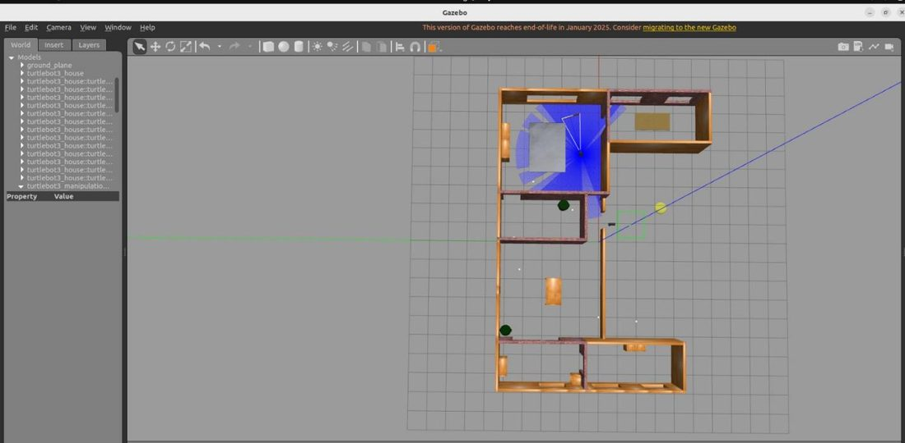

# AI Task Planning for a Home Service Robot

**AI in Robotics (MCTR 912) · German University in Cairo · 2025 · Team project (4 members)**

**Documentation:** [Milestone 3 report (PDF)](1-%20Project%20Report/AI%20in%20Robotics%20m3.pdf)

## Overview

An integrated symbolic-planning and navigation system for a simulated domestic service robot. User-defined goals, such as relocating an object to another room, are automatically translated into executable action plans and carried out in a simulated apartment.

## Technical Approach

A knowledge base represents a four-room apartment (kitchen, living room, bedroom and bathroom), its connectivity, eight household objects and the robot state. User goals are converted into PDDL problem files and solved with the Fast Downward classical planner, producing sequences of *move*, *pick* and *place* actions. A plan-executor node maps navigation actions to ROS 2 Nav2 goals and updates the knowledge base after each step. The system was demonstrated with a TurtleBot3 equipped with an OpenManipulator arm in Gazebo.

<!--
## My Role

Replace this paragraph with one or two sentences about your personal contribution,
then delete the first and last lines of this block so the section becomes visible.
-->

## Repository Contents

| Folder | Contents |
|---|---|
| [1- Project Report](1-%20Project%20Report/) | Milestone 3 report (PDF) |

**Team:** Bassam Walid, Styven Hany, Youssef Mohamed, Verina Maged 
**Tools:** ROS 2 · Nav2 · Gazebo · PDDL · Fast Downward · Python
