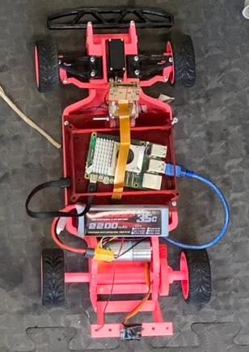
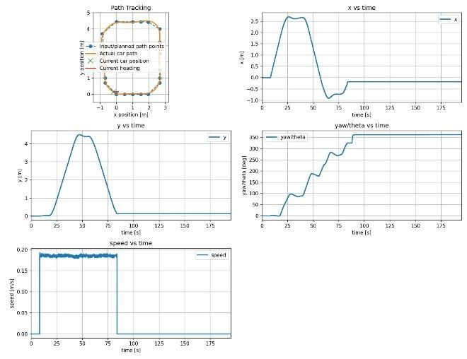

# Autonomous Path-Tracking Vehicle

**Autonomous Systems (MCTR 1002) · German University in Cairo · Spring 2026 · Team project (6 members)**

  
  

**Documentation:** [Project report (PDF)](1-%20Project%20Report/Report.pdf)

## Overview

A small-scale autonomous vehicle capable of path following, obstacle-avoiding lane changes and navigation of a curved city circuit. The ROS 2 software stack was developed and validated in Gazebo simulation before deployment on a physical vehicle built around a Raspberry Pi 5 and an Arduino Uno.

## Key Results (Physical Vehicle)

| Test track | Result |
|---|---|
| Straight track (10 m) | Lateral deviation below **4.5 cm** |
| Two-lane track with obstacles | Lane changes around two obstacles with a maximum cross-track error of **3.4 cm** |
| Curved city track | Completed a **full lap** and returned to the start zone |

## Technical Approach

**Simulation (ROS 2 / Gazebo).** Kalman-filter localization on noisy odometry, path planners for three track layouts, lateral control with Pure Pursuit (and a Stanley controller on the city track), and closed-loop speed control.

**Physical vehicle.** The Raspberry Pi 5 runs the ROS 2 planning and Pure Pursuit nodes with a speed-scaled lookahead distance. The Arduino Uno performs encoder- and IMU-based (MPU6050) dead reckoning with digital filtering, runs the low-level motor-speed loop and drives the steering servo. The two boards communicate over a USB serial link.

## My Role

Developed the Pure Pursuit path-tracking controller and deployed it on the Raspberry Pi; the vehicle followed the planned path both in the ROS 2/Gazebo simulation and on the physical hardware.

## Repository Contents

| Folder | Contents |
|---|---|
| [1- Project Report](1-%20Project%20Report/) | Final report (PDF) |
| [2- Presentation PPT](2-%20Presentation%20PPT/) | Presentation and poster |
| [3- Source Code & Other Relevent Data](3-%20Source%20Code%20%26%20Other%20Relevent%20Data/) | `ROS2`: simulation package (planners, controllers, Kalman filter, Gazebo worlds) · `Pi`: ROS 2 code for the physical vehicle · `Arduino`: low-level motor and sensor firmware · `Test Data`: result plots |
| [4- Videos](4-%20Videos/) | Test-run videos (zip) |

**Team:** Youssef Mohamed, Bassam Walid, Styven Hany, Somaya Magdy, Yassin Hesham, Mostafa Shakweer 
**Tools:** ROS 2 · Python · Gazebo · Raspberry Pi 5 · Arduino (C++) · MPU6050 IMU · Kalman filter · Pure Pursuit · Stanley controller
