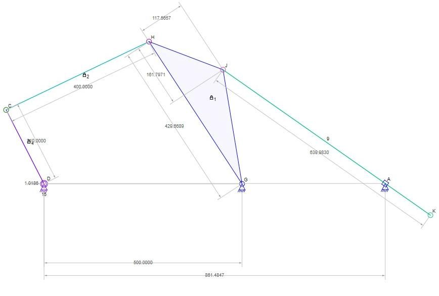
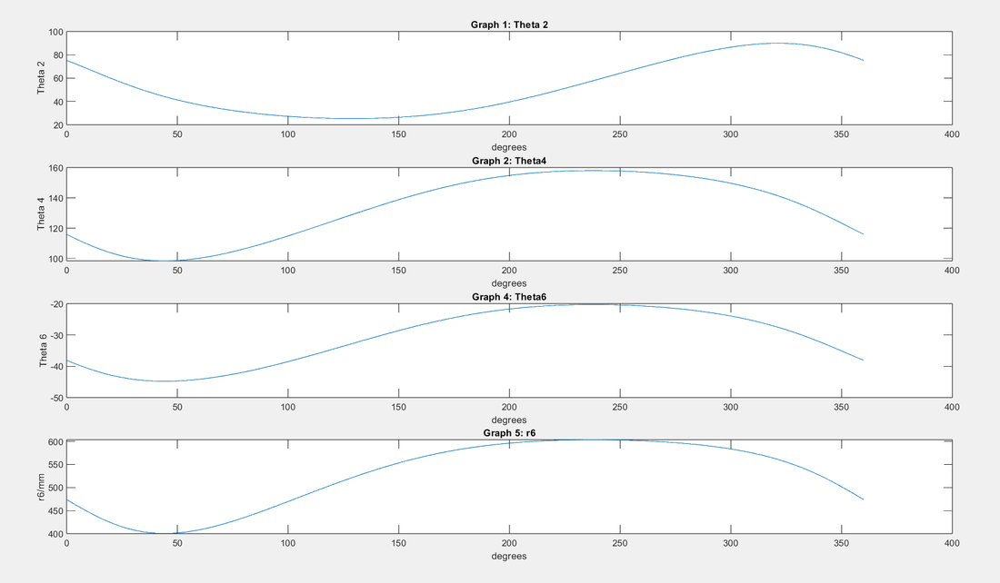

# 📐 Kinematic Analysis of a Compound Mechanism

**Machine Design (EDPT 903) · German University in Cairo · 2024 · Team 21 (2 students)** 
Supervisor: Prof. Imam Morgan

  
  

📄 [Read the report (PDF)](1-%20Project%20Report/Project%20Report.pdf)

## Summary

A complete motion analysis of a two-loop mechanism (a four-bar linkage that drives a sliding link): the position, speed and acceleration of every link during a full turn of the input crank.

## How it works

The loop equations for position, velocity and acceleration were derived by hand. A MATLAB script then solved them numerically (with `fsolve`) for every degree of crank rotation from 0° to 360°, with the crank turning at 10 rad/s, and plotted the results. The mechanism was also built in the Linkage software to check the answers.

## My role

✏️ *[Replace this line with 1–2 sentences about what you personally did in this project.]*

## What's in this folder

| Folder | Contents |
|---|---|
| [1- Project Report](1-%20Project%20Report/) | Hand calculations, MATLAB code and plots (PDF) |
| [2- Source Code](2-%20Source%20Code/) | MATLAB scripts — `MD.m` is the main script |

**Team:** Bassam Walid Fawzy, Styven Hany Nabil 
**Tools:** MATLAB · Linkage
