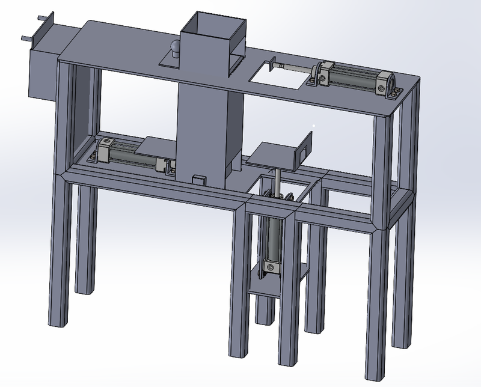
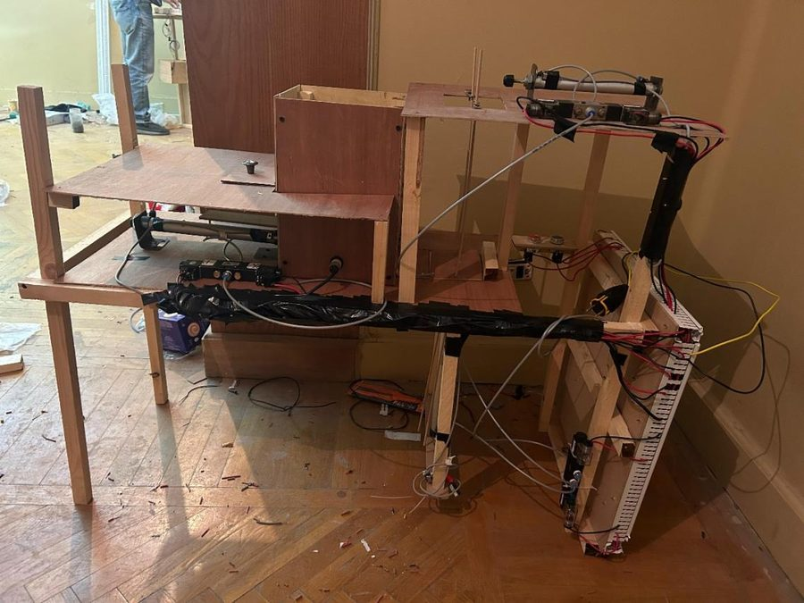

# 🏭 Electro-Pneumatic Pick-and-Place Station

**Mechatronics Lab (MCTR 704) · German University in Cairo · Winter 2024 · Team of 2**

  
  

📄 [Read the project documentation (PDF)](1-%20Project%20Report/Report.PDF)

## Summary

An automated station (100 × 40 × 80 cm) that takes parts out of a magazine, lifts them and moves them to a higher platform using three pneumatic cylinders, controlled by an electrical relay circuit.

## How it works

Cylinder A pushes one part out of the magazine; cylinder B lifts it on a moving table while A pulls back; then cylinder C pushes the part to its final position before B and C return. In standard notation the sequence is **A+ (B+ A−) C+ (B− C−)**. Six reed switches tell the circuit where each cylinder is, a sensor checks that a part is present, and three 5/2 solenoid valves move the cylinders. The cycle starts with a push button. The station was designed in SolidWorks, simulated in Festo FluidSim, then built and tested.

## My role

✏️ *[Replace this line with 1–2 sentences about what you personally did in this project.]*

## What's in this folder

| Folder | Contents |
|---|---|
| [1- Project Report](1-%20Project%20Report/) | Project documentation (PDF) |
| [2- FluidSim](2-%20FluidSim/) | Circuit simulation files |
| [3- Solid Works](3-%20Solid%20Works/) | 3D model (zip) |
| [4- Pictures](4-%20Pictures/) | CAD screenshot and control-panel photo |
| [5- Videos](5-%20Videos/) | The station running |

**Team:** Bassam Walid, Euginia Kamal Anwar 
**Tools:** Festo FluidSim · SolidWorks · Pneumatics · Relay control
