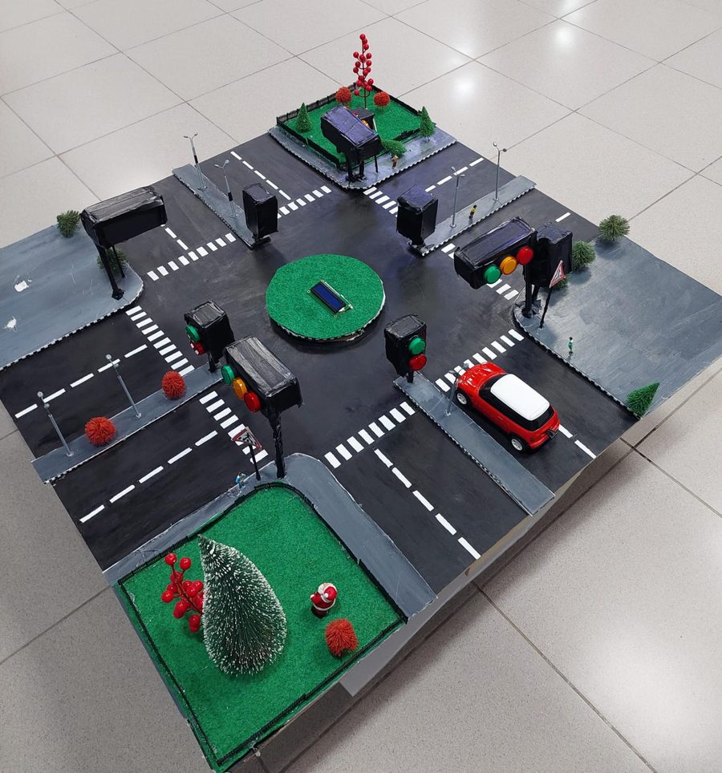

# 🚥 FPGA Traffic-Light Controller

**Digital System Design (ELCT 501) · German University in Cairo · Winter 2023 · Team 9 (11 students)**

📄 [Read the report (PDF)](1-%20Project%20Report/DSD%20Report.pdf)

## Summary

A traffic-light system for a two-way intersection, written in VHDL and running on a Basys 3 FPGA board. It was demonstrated on a scale model of an intersection with real 220 V lamps.

## How it works

A 7-state finite state machine controls the car and pedestrian lights (green 60 s, yellow 3 s, red 66 s). Infrared sensors detect a car that runs a red light and sound a buzzer. A custom VHDL driver shows messages on a 16×2 LCD screen, and relays switch the 220 V lamps on the model. The design was tested with a testbench in Vivado. A temperature sensor (LM35) is read by an Arduino, because the FPGA's analog input could not be used for it.

## My role

Group representative for the 11-member team. ✏️ *[Add 1 sentence about what you built, then delete this note.]*

## What's in this folder

| Folder | Contents |
|---|---|
| [1- Project Report](1-%20Project%20Report/) | Report with code and simulation results (PDF) |
| [2- Source Code](2-%20Source%20Code/) | `Working System Code` = final Vivado project · `Code for Testing the system` = version with shorter timings for simulation |
| [3- Pictures](3-%20Pictures/) | The scale model |
| [4- Videos](4-%20Videos/) | Video explanation |

**Team:** Mohammed Osama, Styven Hany, Bassam Walid, Kareem Hassan, Ahmed Amr, Yousef Nader Greiss, Somaya Magdy, Sara Hany, Yousef Mohammed, Ali Fathy, Mostafa Shakweer 
**Tools:** VHDL · Vivado · Basys 3 FPGA · Arduino
