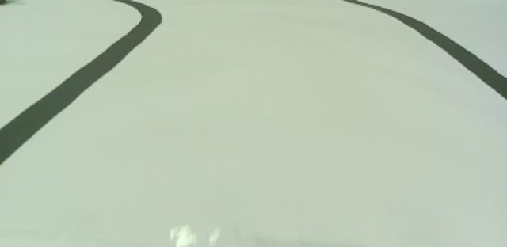
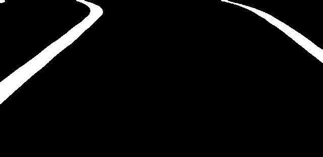
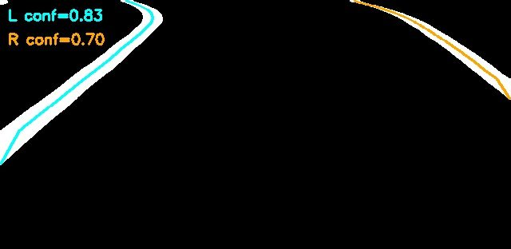
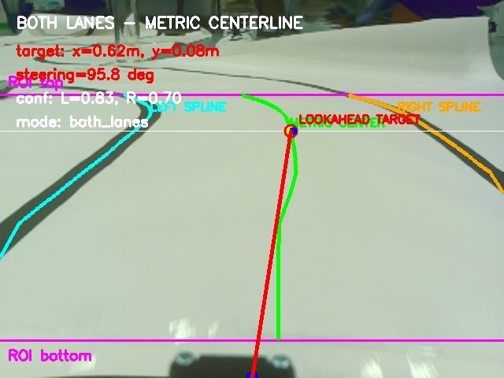

# 👁️ Vision-Based Lane Keeping for a Scale Car

**Image Processing for Mechatronics (MCTR 1010) · German University in Cairo · Spring 2026 · Team 6 (6 students)** 
Supervisor: Assoc. Prof. Omar M. Shehata

| 1. Camera view | 2. Black & white | 3. Noise removed | 4. Lanes fitted | 5. Final result |
|:-:|:-:|:-:|:-:|:-:|
|  |  |  |  |  |

📄 [Read the report (PDF)](1-%20Project%20Report/M4_Team06.pdf)

## Summary

A camera on a small 3D-printed car finds the black lane lines in real time and steers the car so it stays in its lane. Everything runs on a Raspberry Pi with ROS 2 and OpenCV, and an Arduino drives the motor and the steering.

## Results

| Measure | Result |
|---|---|
| Processing speed | **20.8 frames per second** (38.6 ms per frame) on a Raspberry Pi |
| Works when | both lane lines are visible, only one is visible, or the lane is briefly lost |

## How it works

Each camera frame is cropped to the road area, blurred and turned into black and white so only the lane lines remain, and small specks of noise are removed (morphological opening). The lane lines are fitted with smooth curves (cubic Hermite splines), and a homography converts their positions from pixels into real distances in metres. The middle of the lane gives a target point ahead of the car; a Kalman-style filter keeps that target steady, and a Pure Pursuit controller turns it into a steering angle. If only one line is visible, the system places the lane center 15 cm away from it.

## My role

✏️ *[Replace this line with 1–2 sentences about what you personally did in this project.]*

## What's in this folder

| Folder | Contents |
|---|---|
| [1- Project Report](1-%20Project%20Report/) | Final report (PDF) |
| [2- Presentation PPT](2-%20Presentation%20PPT/) | Presentation and poster |
| [3- Source Code](3-%20Source%20Code/) | ROS 2 package (zip): camera node, lane-detection node and serial link to the Arduino |
| [4- Pictures](4-%20Pictures/) | Circuit diagram and processed camera images (zip) |
| [5- Videos](5-%20Videos/) | Two test runs on the track |

**Team:** Youssef Mohamed Abodeb, Somaya Magdy, Bassam Walid, Styven Hany, Mostafa Shakweer, Hassan Yassar 
**Tools:** Python · OpenCV · ROS 2 · Raspberry Pi · Arduino
