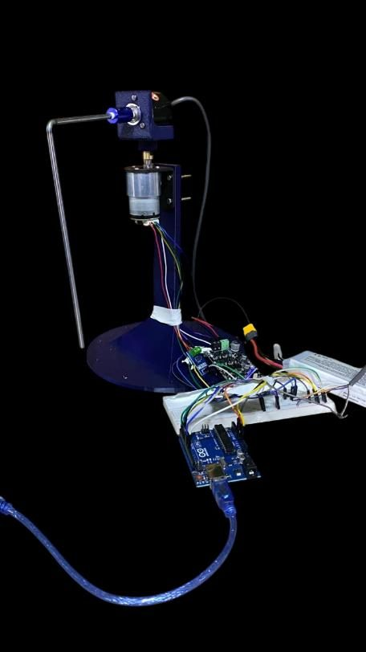
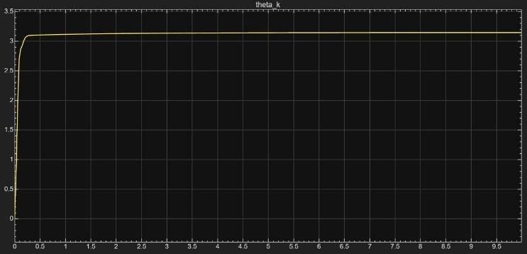

# Nonlinear Control of a Furuta Pendulum

**Course project · German University in Cairo · Winter 2025 · Team project (6 members)**

**Documentation:** [Project report (PDF)](1-%20Project%20Report/Advanced%20Team29.pdf)

## Overview

The Furuta (rotary inverted) pendulum is a benchmark underactuated, nonlinear control problem: a motor drives a horizontal arm, and the unactuated pendulum at its end must be stabilized in the upright position. This project covers the modeling, nonlinear controller design and real-time validation of the system.

## Results

In simulation, the backstepping controller stabilizes the pendulum at the upright equilibrium in approximately **0.5 s** from a range of initial conditions, within the actuator limits of ±1 N·m torque and the motor's maximum speed. The controller was then validated in real time on the physical rig using a Raspberry Pi 5.

## Technical Approach

**Modeling.** Nonlinear equations of motion derived with the Euler–Lagrange formulation, including viscous friction, and implemented in MATLAB/Simulink.

**Control.** Lyapunov-based backstepping controller supervised by a Stateflow chart that manages the initialization, stabilization and balanced operating modes. Controller gains were selected through an automated parameter sweep requiring the pendulum to remain within 0.1 rad of upright for 5 s.

**Hardware.** Test rig with a JGB37-520 DC motor, an MD10C motor driver, a 2000 P/R rotary encoder, an ACS712 current sensor, an Arduino Uno and a Raspberry Pi 5.

## My Role

Derived the nonlinear dynamics using the Euler–Lagrange formulation, built the MATLAB/Simulink model, and implemented the backstepping controller, which was validated in real time on a Raspberry Pi 5.

## Repository Contents

| Folder | Contents |
|---|---|
| [1- Project Report](1-%20Project%20Report/) | Paper-format project report (PDF) |
| [2- Source Code](2-%20Source%20Code/) | Simulink model, controller and gain-tuning scripts |
| [3- Pictures](3-%20Pictures/) | Test rig |
| [4- Videos](4-%20Videos/) | Project video |

**Team:** Bassam Walid, Styven Hany, Youssef Mohamed Abodeb, Yassin Hesham, Mostafa Shakweer, Somaya Magdy 
**Tools:** MATLAB · Simulink · Stateflow · Arduino · Raspberry Pi 5
