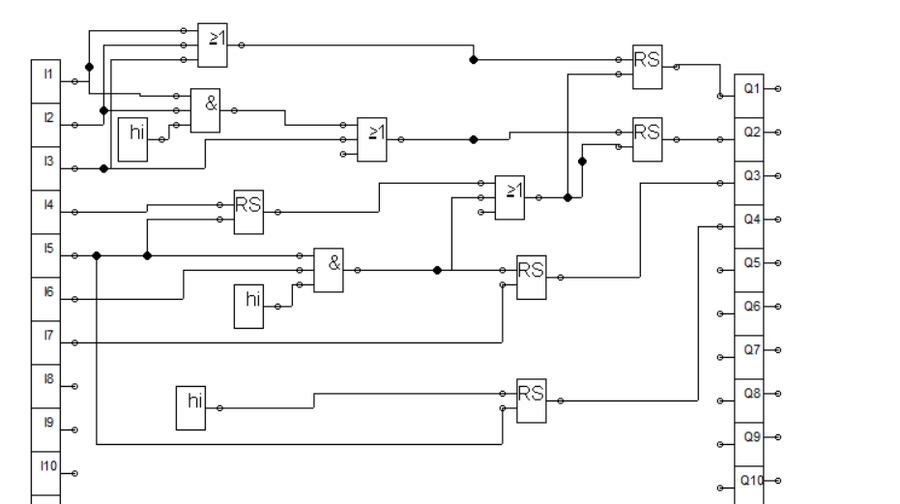
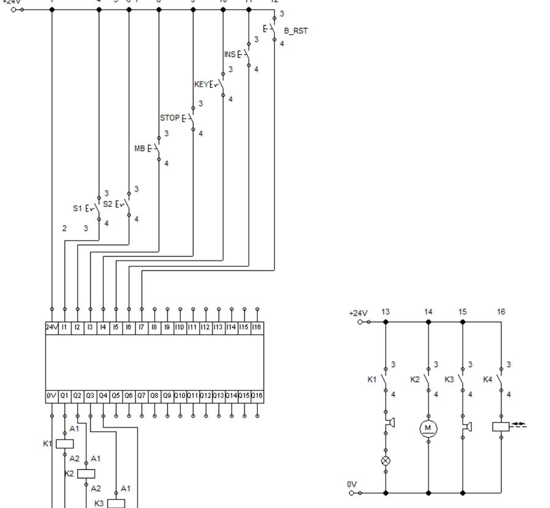

# ⚙️ PLC & Logic Control Exercises

**Mechatronics lab exercises · German University in Cairo · 2024**

  
  

## Summary

Practice circuits for controlling pneumatic cylinders, built and simulated in Festo FluidSim. They include relay (ladder-style) circuits and logic programs made from function blocks — AND and OR gates and RS flip-flops (memory latches) — like the ones used to program small PLCs.

## What's in this folder

| Folder | Contents |
|---|---|
| [1- Fluid Sim](1-%20Fluid%20Sim/) | FluidSim circuit files |
| [2- Pictures](2-%20Pictures/) | Screenshots of the circuits |
| [3- Videos](3-%20Videos/) | Screen recording of a simulation |

**Tools:** Festo FluidSim · Function block diagrams · Relay logic
