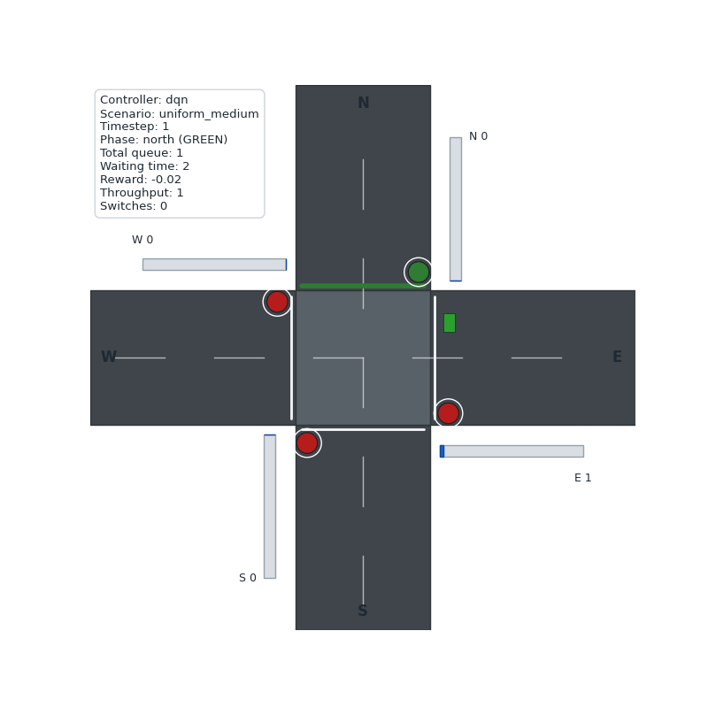
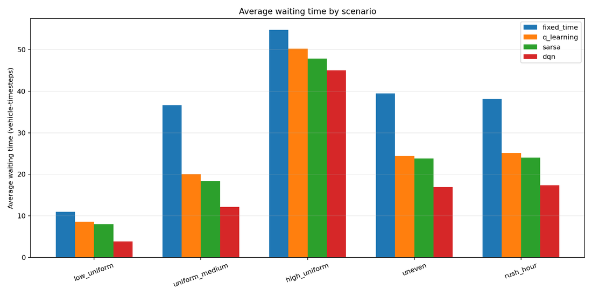

# 🚦 Traffic-Light Control with Reinforcement Learning

**Reinforcement Learning & Optimal Control (MCTR 1024) · German University in Cairo · Spring 2026 · Team 21 (5 students)**

<em>The trained DQN agent controlling the simulated intersection</em>

📄 [Read the report (PDF)](1-%20Project%20Report/Team21_Final_Report.pdf)

## Summary

Normal traffic lights switch on a fixed timer. In this project, an AI agent learns *when* to give each direction a green light by watching the queues of cars. We built an intersection simulator in Python and compared a fixed-timer controller with three reinforcement-learning methods: Q-learning, SARSA and a Deep Q-Network (DQN).

## Results

Average over five traffic scenarios (light, medium, heavy, uneven and rush-hour traffic), compared with the fixed-timer controller:

| Controller | Average waiting time | Average queue length |
|---|---|---|
| Q-learning | 29 % lower | 30 % lower |
| SARSA | 32 % lower | 34 % lower |
| **DQN** | **47 % lower** | **49 % lower** |

DQN performed best overall. Of the two simpler table-based methods, Q-learning scored higher overall because it switched the lights less often than SARSA.

## How it works

**Simulator.** A four-way intersection where cars arrive at random, a yellow light runs between green phases, and each lane can hold up to 40 cars.

**Learning.** The agent sees the queue lengths and the current light, and chooses which direction gets the green light. Several reward formulas were tested; the final one rewards shorter queues, less waiting and more cars passing, and penalizes switching the lights too often.

**DQN.** A neural network in PyTorch with experience replay and a target network, using 19 inputs that describe the state of the intersection.

## My role

✏️ *[Replace this line with 1–2 sentences about what you personally did in this project.]*

## What's in this folder

| Folder | Contents |
|---|---|
| [1- Project Report](1-%20Project%20Report/) | Final report (PDF) |
| [2- Source Code](2-%20Source%20Code/Code/) | Python code: simulator, agents, training and evaluation — [how to run it](2-%20Source%20Code/Code/README.md) |
| [results](2-%20Source%20Code/Code/results/) | Trained models, logs, charts and animations |

**Team:** Styven Hany, Bassam Walid, Somaya Magdy, Ali Khaled, Youssef Mohamed 
**Tools:** Python · PyTorch · NumPy · pandas · Matplotlib
