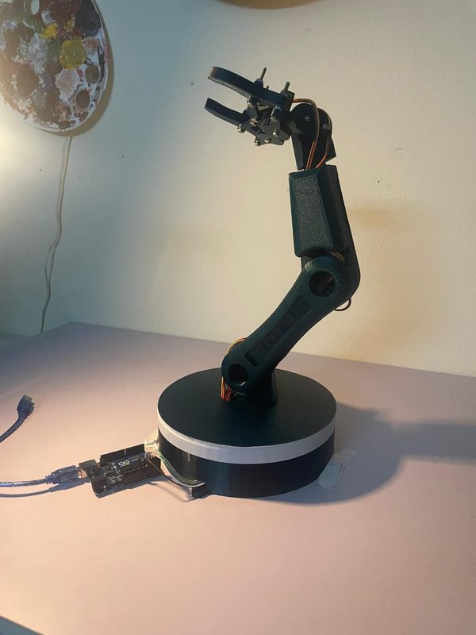
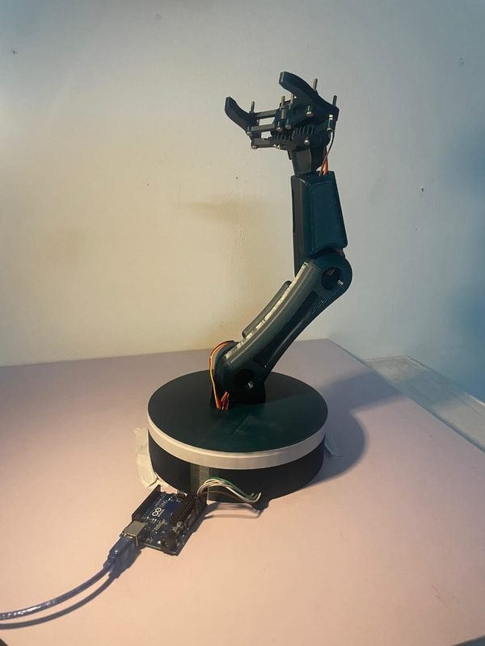

# 4-DOF Pick-and-Place Robotic Arm

**Robotics course project · German University in Cairo · Winter 2025 · Team project (6 members)**

  
  

## Overview

A four-degree-of-freedom serial manipulator for pick-and-place tasks. The project covers kinematic modeling, trajectory planning, simulation and a physical prototype driven by four servo motors and controlled by a Raspberry Pi.

## Technical Approach

**Kinematics.** Denavit–Hartenberg (DH) modeling with forward and inverse position kinematics to compute the joint angles for the pick and place poses, and Jacobian-based velocity kinematics.

**Trajectory planning.** Straight-line and spiral end-effector trajectories, with evaluation of the final positioning error.

**Simulation.** The SolidWorks model was imported into Simscape Multibody and complemented by a Gazebo simulation; the kinematics functions were exported to C++ with MATLAB Coder.

**Hardware.** Physical prototype actuated by four servo motors and controlled by a Raspberry Pi.

<!--
## My Role

Replace this paragraph with one or two sentences about your personal contribution,
then delete the first and last lines of this block so the section becomes visible.
-->

## Repository Contents

| Folder | Contents |
|---|---|
| [1- Presentation PPT](1-%20Presentation%20PPT/) | Final presentation |
| [2- Source Code](2-%20Source%20Code/) | MATLAB code, Simscape model and CAD files (zip) |
| [3- Pictures](3-%20Pictures/) | Photos of the prototype |
| [4- Videos](4-%20Videos/) | Demonstration videos |

**Team:** Bassam Walid, Mostafa Shakweer, Somaya Magdy, Styven Hany, Yassin Hesham, Youssef Mohamed 
**Tools:** MATLAB · Simulink · Simscape Multibody · Gazebo · SolidWorks · Raspberry Pi
