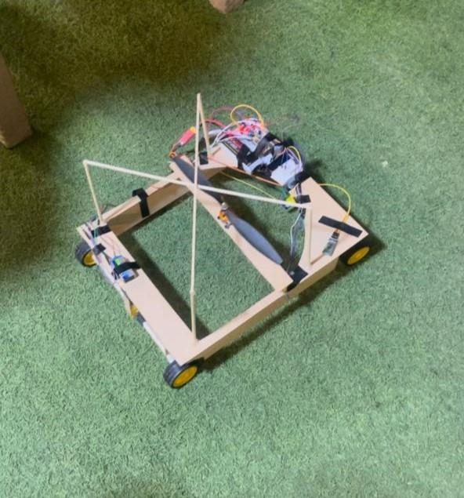
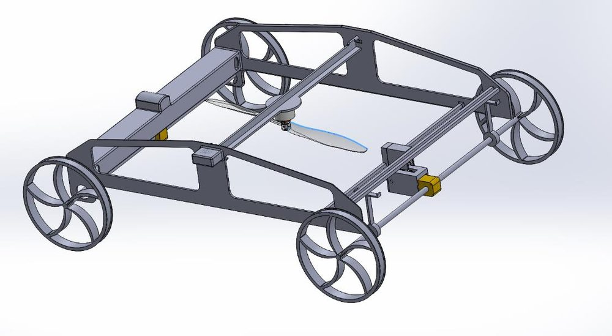
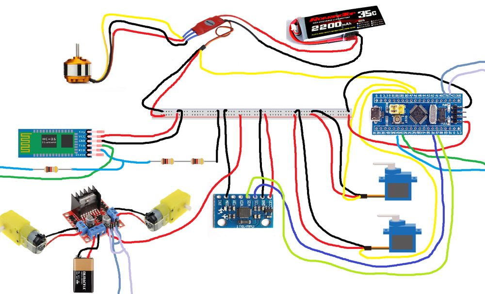

# Wall-Climbing RC Robot

**Mechatronics Engineering (MCTR 601) · German University in Cairo · Spring 2024 · Team project (3 members)**

  
  

**Documentation:** [Project report (PDF)](1-%20Project%20Report/Final%20Report.pdf)

## Overview

A remote-controlled robot capable of driving on walls of varying inclination. Propeller thrust presses the four-wheel-drive chassis against the surface to generate traction, while gyroscope-driven PID control adjusts the propeller direction to counter gravity, allowing the robot to hold its position or drive on the wall. The robot is operated from a smartphone via Bluetooth.

## Technical Approach

**Mechanical design.** A balsa-wood prototype validated the concept by holding itself on a wall unaided, but revealed axle bending under propeller load. The final chassis was designed in SolidWorks and 3D-printed in PLA, with axle supports, a lowered center of mass, and 3D-printed wheels fitted with bicycle-tire rubber for additional grip. Propeller thrust was measured experimentally to confirm the required wall-adhesion force.

**Electronics.** STM32F103 ("Blue Pill") microcontroller, A2212 brushless motor with a 12-inch propeller and a 30 A ESC powered by a 3S LiPo battery, MPU6050 gyroscope, servo motors, an L298N driver for the four wheel motors, and an HC-05 Bluetooth module.

**Software.** FreeRTOS runs concurrent tasks for propeller-angle control and Bluetooth command handling; the servo control loop was tuned in MATLAB/Simulink.

## My Role

Engineered the STM32-based control system, in which gyroscope-driven PID control adjusts the propeller direction to counter gravity so that the robot can hold its position or drive on walls of varying inclination.

## Repository Contents

| Folder | Contents |
|---|---|
| [1- Project Report](1-%20Project%20Report/) | Final report (PDF) |
| [2- Source Code](2-%20Source%20Code/) | STM32 firmware (Arduino IDE): final version and test programs for the motor, gyroscope and Bluetooth |
| [3- Solid Works](3-%20Solid%20Works/) | CAD models (zip) |
| [4- Pictures](4-%20Pictures/) | Wiring diagram |
| [5- Videos](5-%20Videos/) | Demonstration videos |

**Team:** Bassam Walid, Styven Hany, Youssef Mohamed 
**Tools:** STM32 · FreeRTOS · C/C++ · SolidWorks · 3D printing · MATLAB/Simulink
