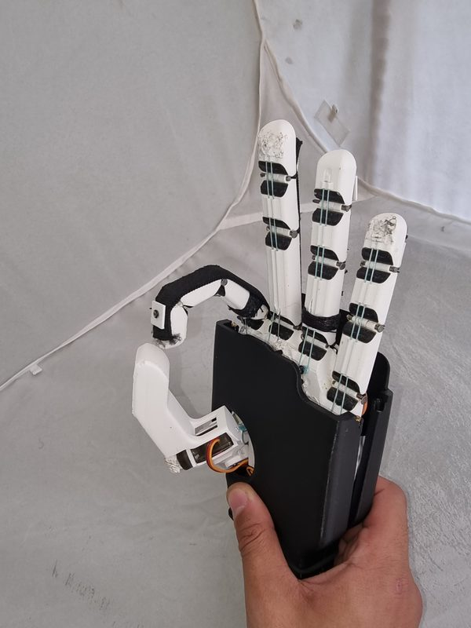
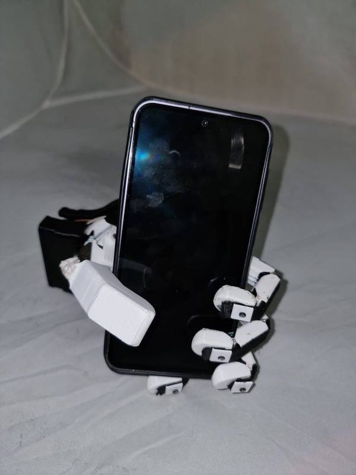
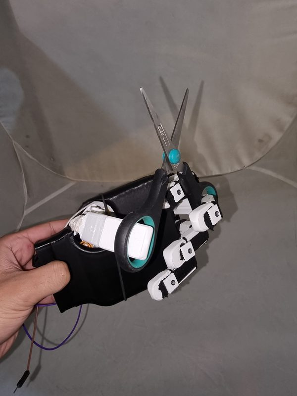

# sEMG-Controlled Tendon-Driven Prosthetic Hand

**Bachelor Thesis (Grade A+) · Mechatronics Engineering · German University in Cairo · May 2025** 
Official title: *Brain-Computer Interface for Prosthetic Device Using EMG* · Supervisor: Assoc. Prof. Dr. Eng. Amir Roushdy Ali

  
  
  
  

**Documentation:** [Full thesis (PDF)](1-%20Thesis/Thesis%202.0.pdf)

## Overview

Design, development and validation of a low-cost, tendon-driven bionic hand for below-elbow amputees, controlled in real time by surface electromyography (sEMG) signals from the forearm. The project addresses the cost and accessibility barriers that limit access to myoelectric prostheses in Egypt.

## Key Results

| Metric | Result |
|---|---|
| Grip and wrist-flexion detection | **100%** (10 test subjects) |
| Individual finger-flexion detection | **98.25%** (7 errors in 400 movements) |
| Load capacity | **5 kg (≈ 49 N)** without holding torque |
| Finger range of motion | Up to **95°** |
| Finger flexion time | **0.835 s** (calculated) |
| Battery charging (USB-C) | Full charge in **27 min** |
| Total cost | **≈ 5,000 EGP (≈ US$100)** |

## Technical Approach

**Mechanical design.** Tendon-driven fingers: braided fishing line provides active flexion, elastic bands provide passive extension, and rubber dampers between the phalanges emulate cartilage. The hand was refined over 11 SolidWorks iterations into a 151-part assembly and 3D-printed in PLA and TPU.

**Actuation and power.** Four gearbox-modified N20 DC motors driven by TB6612FNG drivers actuate the fingers, and an MG90S servo provides thumb opposition. A custom 2S LiPo battery with a battery-management system supports USB-C charging, and actuation is disabled automatically while the hand is charging.

**Signal processing and control.** An STM32F401 microcontroller samples the conditioned sEMG signal every 10 ms. After a 5-second self-calibration on the relaxed muscle, the signal is smoothed with an exponential moving average and compared against an adaptive threshold with hysteresis, enabling reliable, user-independent control without machine learning.

**Experimental validation.** The system was tested on 10 subjects with electrodes on different forearm muscle groups; the flexor digitorum superficialis provided the most reliable signal. The hand performed multiple grip patterns, grasping a mug, a phone, scissors, a pencil and a full 0.6 L water bottle, and lifted a 5 kg dumbbell.

## Follow-up: Bond-Graph Model (2026)

In the course *Mechatronics Programming for Real-Time Systems (MCTR 1015)*, the hand's dynamics were modeled with bond graphs in 20-sim, covering the sEMG signal chain, DC motors, gearing, tendon compliance and finger joints. The resulting state-space model was tuned against target values of 40 N tendon force and 45° joint flexion. Team: Bassam Walid, Youssef Mohamed. Files: [8- Bond Graph Analysis](8-%20Bond%20Graph%20Analysis/).

## Repository Contents

| Folder | Contents |
|---|---|
| [1- Thesis](1-%20Thesis/) | Full thesis (PDF) |
| [2- Presentation PPT](2-%20Presentation%20PPT/) | Thesis defense presentation |
| [3- Source Arduino Code](3-%20Source%20Arduino%20Code/) | Microcontroller firmware; the final version is `V6_FinalVersion` |
| [4- Solid Works](4-%20Solid%20Works/) | Final CAD model (zip) |
| [5- Pictures](5-%20Pictures/) | Prototype photos and an illustrated user guide (charging, electrode placement) |
| [6- Videos](6-%20Videos/) | Grip tests, finger flexion and sEMG control demonstrations |
| [7- Previous Design Iterations](7-%20Previous%20Design%20Iterations/) | Earlier CAD iterations |
| [8- Bond Graph Analysis](8-%20Bond%20Graph%20Analysis/) | 20-sim models, report and presentation |

**Tools:** SolidWorks · 3D printing (PLA, TPU) · STM32 · C/C++ · sEMG sensors · 20-sim
